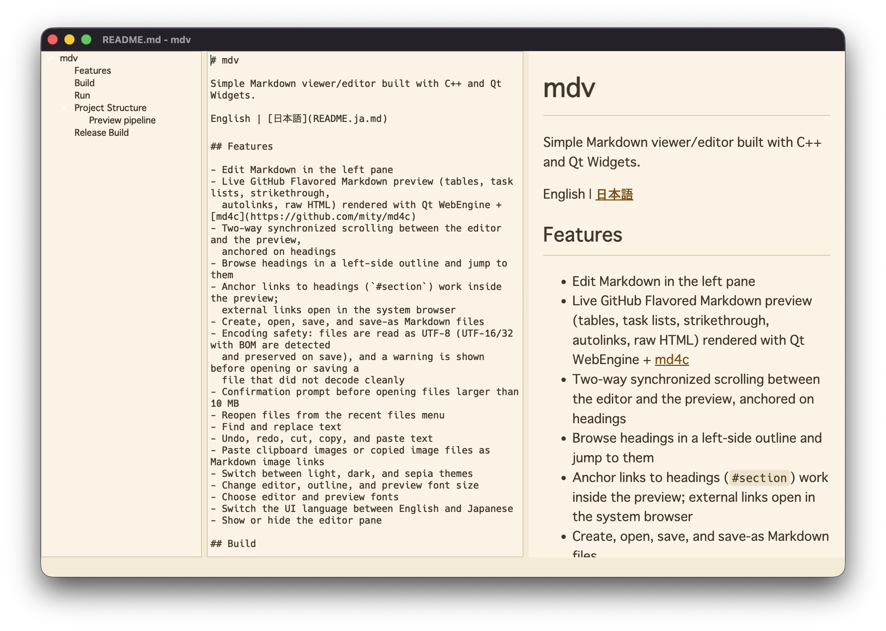
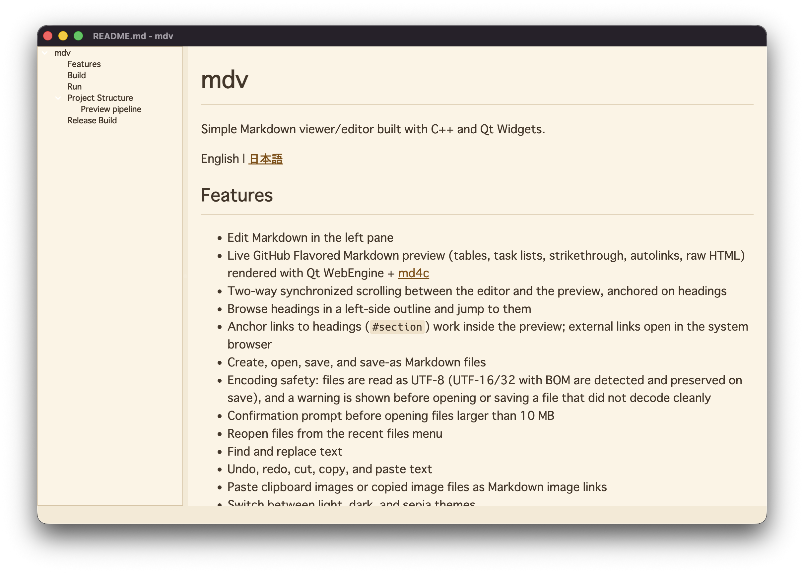

# mdv

C++ と Qt Widgets で作られたシンプルな Markdown ビュワー/エディタです。

[English](README.md) | 日本語

## スクリーンショット

エディタとライブプレビュー:



ビュワーモード(`-v`、編集ペイン非表示):



## 機能

- 左ペインで Markdown を編集
- GitHub Flavored Markdown のライブプレビュー(表・タスクリスト・打ち消し線・
  オートリンク・生 HTML)。Qt WebEngine + [md4c](https://github.com/mity/md4c) で描画
- エディタとプレビューの双方向スクロール同期(見出しアンカー方式)
- 左側のアウトラインで見出しを一覧・ジャンプ
- プレビュー内の見出しアンカーリンク(`#section`)に対応。
  外部リンクはシステムブラウザで開く
- Markdown ファイルの新規作成・読み込み・保存・名前を付けて保存
- 文字コードの安全性: UTF-8 として読み込み(BOM 付き UTF-16/32 は自動判別し、
  保存時も同じエンコーディングを維持)。正しくデコードできないファイルは
  開く前・保存前に警告
- 10 MB を超えるファイルを開く前に確認ダイアログを表示
- 最近開いたファイルメニュー
- 検索と置換。マッチはエディタとプレビューの両方でハイライト
  (全マッチをマークし、現在のマッチは強調表示+自動スクロール)
- 元に戻す・やり直し・切り取り・コピー・貼り付け
- クリップボードの画像や画像ファイルを Markdown の画像リンクとして貼り付け
- ライト・ダーク・セピアのテーマ切り替え
- エディタ・アウトライン・プレビューの文字サイズ変更
- エディタとプレビューのフォント選択
- UI 言語の切り替え(英語/日本語)
- 編集ペインの表示/非表示

## ビルド

WebEngine および WebChannel モジュールを含む Qt が必要です(macOS では `brew install qt`)。

```sh
cmake -S . -B build
cmake --build build
```

## 実行

macOS:

```sh
open build/mdv.app
```

その他のプラットフォーム:

```sh
./build/mdv
```

引数にファイルを渡すと直接開けます:

```sh
open -a mdv README.md                        # macOS(インストール済みアプリ)
build/mdv.app/Contents/MacOS/mdv README.md   # macOS(バイナリ直接実行)
./build/mdv README.md                        # その他
```

macOS では Finder の「このアプリケーションで開く」や、Dock アイコンへの
ドロップでもファイルを開けます。

編集ペインを隠したビュワーモードで起動:

```sh
open build/mdv.app --args -v   # macOS
./build/mdv -v                 # その他
```

「開く」「名前を付けて保存」ダイアログの初期ディレクトリはカレントディレクトリ
です(Finder から起動した場合はホーム)。以後は最後に使ったディレクトリを
記憶します。「名前を付けて保存」は開いているファイルの名前だけを引き継ぐため、
開いたファイルの場所に保存先が引きずられることはありません。

## プロジェクト構成

```
src/main.cpp        アプリケーション本体(ウィンドウ、エディタ、プレビュー、同期)
third_party/md4c/   ベンダリングした md4c Markdown パーサ(MIT ライセンス)
resources/          アプリアイコンのソースと macOS アイコンセット
scripts/            macOS のリリース・署名・アイコン生成スクリプト
tools/icon_renderer アイコンスクリプトが使う SVG→PNG 変換ヘルパー
```

### プレビューの仕組み

エディタのテキストを md4c(GitHub 方言)で HTML に変換し、`QWebEngineView` に
流し込みます。テーマ CSS を含むテンプレートページは一度だけロードし、以後は
ページ内容だけを 120ms のデバウンス付きで差し替えるため、入力中にプレビューが
ちらついたりスクロール位置を失ったりしません。スクロール同期は両ペインの
見出しを対応付けて区間内を線形補間する方式で、プレビュー側のスクロールは
`QWebChannel` 経由でエディタに通知されます。プレビュー内のリンクをクリックしても
ページ遷移は起きず、http/https/mailto はシステムブラウザで開き、それ以外の
スキームはブロックされます。

## リリースビルド

macOS で Release ビルドのアプリバンドルを作成:

```sh
scripts/macos_build_release.sh
```

`resources/icon.svg` から macOS アプリアイコンを再生成:

```sh
scripts/macos_generate_icon.sh
```

署名・DMG 作成・公証(ノータライズ)・ステープル:

```sh
scripts/macos_sign_dmg_notarize.sh
```

DMG は `dist/macos/mdv-<version>-macos-arm.dmg` として出力されます。

公証スクリプトは既定で `notarytool` という名前で保存された notarytool
プロファイルを使います。必要に応じて環境変数で上書きできます:

```sh
CODESIGN_IDENTITY="Developer ID Application: Name (TEAMID)" \
NOTARY_PROFILE="notarytool" \
scripts/macos_sign_dmg_notarize.sh
```

`scripts/macos/entitlements.plist` の Hardened Runtime エンタイトルメントには、
Qt WebEngine(Chromium)が必要とする JIT 関連のキーが含まれています。

Windows の Release ビルド:

```powershell
.\scripts\build-windows.ps1
```

Release ビルドを作成し、`windeployqt` で Qt ランタイムを
`dist\mdv-windows-x64` に配置します。

Inno Setup で Windows インストーラーを作成:

```powershell
.\scripts\package-windows-inno.ps1
```

インストーラースクリプトは `CMakeLists.txt` からバージョンを読み取り、
`dist\mdv-windows-x64` にある既存のペイロードを使います。その後
`build-inno-installer\mdv.iss` を生成し、`dist\mdiv-<version>-windows-x64.exe` を
出力します。先に `.\scripts\build-windows.ps1` を実行してください。
パッケージ作成時に明示的に再ビルドしたい場合だけ `-Build` を指定します。
Inno Setup を実行せず `.iss` だけ生成する場合は `-GenerateOnly` を指定してください。
