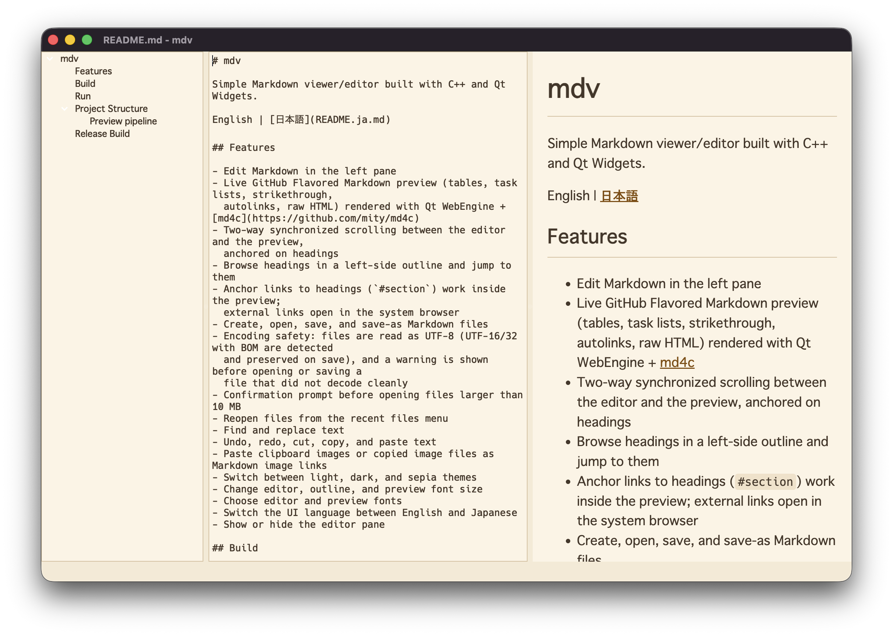
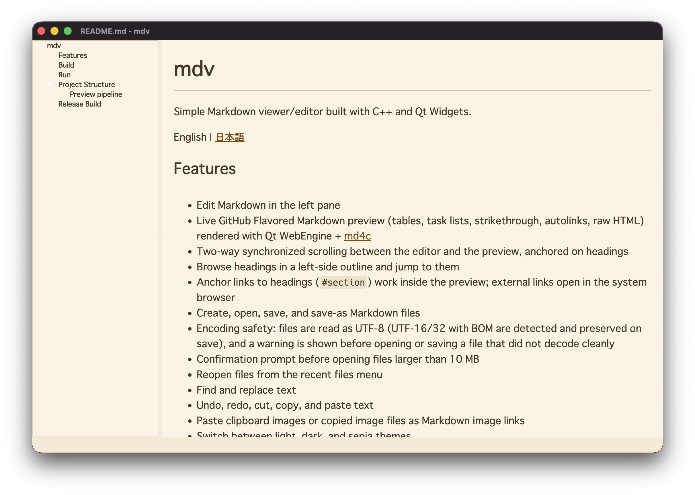

# mdv

C++ と Qt Widgets で作られたシンプルな Markdown ビュワー/エディタです。

[English](README.md) | 日本語

[](https://github.com/fukuyori/mdv/actions/workflows/ci.yml) | [変更履歴](CHANGELOG.ja.md)

## スクリーンショット

エディタとライブプレビュー:



ビュワーモード(`-v`、編集ペイン非表示):



## 機能

- 左ペインで Markdown を編集
- Markdown 向けの入力補助: 改行時の自動インデント、リスト・引用マーカー
  (箇条書き・番号付き・チェックボックス・引用)の自動継続、Shift+Enter で
  プレーン改行、Tab / Shift+Tab で選択行のインデント/解除
- GitHub Flavored Markdown のライブプレビュー(表・タスクリスト・打ち消し線・
  オートリンク)。Qt WebEngine + [md4c](https://github.com/mity/md4c) で描画。
  生 HTML は実行せずテキストとして表示([セキュリティ](#セキュリティ)参照)
- プレビューのコンテキストメニューから選択範囲をコピー。コードブロックは
  ブロック上のボタンで全体を一括コピー
- エディタとプレビューの双方向スクロール同期(見出しアンカー方式)
- 左側のアウトラインで見出しを一覧・ジャンプ
- プレビュー内の見出しアンカーリンク(`#section`)に対応。
  外部リンクはシステムブラウザで開く
- Markdown ファイルの新規作成・読み込み・保存・名前を付けて保存
- 現在のプレビュー表示(原文・対訳・翻訳)を UTF-8 の Markdown ファイルへ
  エクスポート。追従表示・セッションモードでは原文表示をエクスポート可能
- タブ機能: 複数の Markdown ファイルを同時に編集。各タブは独立した
  エディタ・アウトライン・プレビューを持つ。コマンドライン引数や
  ウィンドウへのドラッグ&ドロップで複数ファイルを一度に開ける。
  すでに開いているファイルを開こうとした場合は既存のタブに切り替える
- 複数ウインドウ対応: タブを右クリックして「新しいウインドウで開く」、
  またはタブをタブバーの外へドラッグして新しいウインドウとして切り離せる。
  タブを別の mdv ウインドウへドロップするとそちらへ移動する
- タブが開いているファイルがディスク上で変更された(他のプログラムに
  よる編集など)ことを検知し、再読み込みするか確認
- 追従表示モード(`-f`): ファイルへの追記を自動で再読み込みし、編集ペインを
  隠したプレビューの最終行を常に画面下端へ表示
- Codexの`rollout-*.jsonl`イベントログ、Claude Codeのセッション`.jsonl`
  ファイル、およびAntigravityの`transcript.jsonl`ログを追従表示モードで開くと、
  ユーザーとエージェントの本文だけを時刻付きの読みやすい会話として表示
- セッションモード(`-s`)で、ログのパスを指定せずに最終更新されたAI
  セッション(Codex, Claude, Antigravity)を検出して追従表示
- 文字コードの安全性: UTF-8 として読み込み(BOM 付き UTF-16/32 は自動判別し、
  保存時も同じエンコーディングを維持)。正しくデコードできないファイルは
  開く前・保存前に警告
- 10 MB を超えるファイルを開く前に確認ダイアログを表示
- 最近開いたファイルメニュー
- 検索と置換。マッチはエディタとプレビューの両方でハイライト
  (全マッチをマークし、現在のマッチは強調表示+自動スクロール)
- 元に戻す・やり直し・切り取り・コピー・貼り付け
- クリップボードの画像や画像ファイルを Markdown の画像リンクとして貼り付け
- Mermaid 図とインライン・ブロック形式の LaTeX 数式をプレビューに描画。
  オフライン用ライブラリをアプリに同梱
- フェンスコードブロックを言語に応じてシンタックスハイライト
- GitHub 形式の注記・ヒント・重要・警告・注意アラートを描画
- ライト・ダーク・セピアのテーマ切り替え
- エディタ・アウトライン・プレビューの文字サイズ変更
- エディタとプレビューのフォント選択
- ローカルの [Ollama](https://ollama.com) サーバーによるプレビューの翻訳。
  プレビュー上部のボタンで「原文」「対訳」(原文と訳文を交互に表示)「翻訳」を
  切り替え([翻訳](#翻訳) を参照)。追従表示モードを含め、プレビューで
  選択した範囲だけをコンテキストメニューから翻訳することも可能
- UI 言語の切り替え(英語/日本語)
- プレビュー横の細いトグルまたは表示メニューで編集ペインの表示/非表示を切り替え

## Mermaid と数式

Mermaid 図は、言語名を `mermaid` にしたフェンスコードブロックで記述します。

````markdown

```mermaid
flowchart LR
    A[Markdown] --> B[プレビュー]
```
````

LaTeX 数式は、インラインでは `$...$`、独立した数式では `$$...$$` を使用します。

```markdown
オイラーの等式は $e^{i\pi} + 1 = 0$ です。

$$
\int_{-\infty}^{\infty} e^{-x^2}\,dx = \sqrt{\pi}
$$
```

Mermaid と KaTeX は mdv に同梱されるため、インターネット接続なしで利用できます。
Mermaid の構文に誤りがある場合はエラーメッセージと元のソースを表示し、数式の
構文に誤りがある場合もプレビュー全体を壊さず入力内容を表示します。

## シンタックスハイライトとアラート

開始フェンスの後へ言語名を付けると、コードブロックをハイライトします。

````markdown
```cpp
#include <iostream>

int main() {
    std::cout << "Hello\n";
}
```
````

GitHub 形式のアラートは、引用ブロックの先頭行へ `NOTE`、`TIP`、`IMPORTANT`、
`WARNING`、`CAUTION` のいずれかを記述します。

```markdown
> [!NOTE]
> 補足として役立つ情報です。

> [!WARNING]
> ファイルを上書きする前に保存先を確認してください。
```

同梱の Highlight.js 共通言語ビルドとライト・ダーク・セピア用スタイルにより、
オフラインで動作します。アラートの見出しは選択中のUI言語で表示します。

生 HTML は実行せずテキストとして表示し、リモートリソースは取得せず、ローカル
画像は文書のディレクトリ配下からのみ読み込みます。詳細は
[セキュリティ](#セキュリティ)を参照してください。

## ビルド

### 必要な環境

- CMake 3.16以降
- C++17対応コンパイラ
- Widgets、WebEngine、WebChannel、Networkを含むQt 6.10.3以降

現行リリースはQt 6.11.2でビルド・テストしています。Qt Online
Installerを使う場合は、使用するコンパイラに合うDesktopキットとQt
WebEngine、Qt WebChannelを選択してください。追加のQt依存モジュールは
インストーラーが解決します。ビルド・配布スクリプトは共通の
`qt-default-version.txt`から既定バージョンを読み込みます。

6.10系からの変更幅を抑えたい場合はQt 6.10.3も利用できます。必要な
セキュリティ修正より前のQt 6.10.2は、意図的に対応対象外としています。

別のQtで構成済みのビルドディレクトリは再利用しないでください。Qtの
バージョンを切り替える場合は、以下のように新しい`BUILD_DIR`を指定します。

### Linux

先にCMake、C++コンパイラ、Qtをインストールします。`/usr`配下のQtはOSの
パッケージマネージャーに管理させてください。Qt Online
Installerで取得したQtで手動上書きせず、ユーザーディレクトリへプロジェクト用
Qtを並行導入して`QT_ROOT`で選択します。OS管理のQtは、ディストリビューションが
新バージョンを正式提供した時点で通常のOS更新として更新します。

ビルドスクリプトは既定で`$HOME/Qt/6.11.2/gcc_64`を選択し、次に
`/opt/Qt`、`/usr/local/Qt`下の同じキットを探します。見つからない場合は、
古いシステムQtを黙って使わずエラーにします。Releaseビルドとテスト手順は
次の通りです。

```sh
BUILD_DIR=build-qt6112 \
scripts/linux_build_release.sh

ctest --test-dir build-qt6112 --output-on-failure
build-qt6112/mdv --version
```

実行ファイルは`build-qt6112/mdv`に作成されます。`QT_ROOT`にはバージョンの
親ディレクトリではなく、`bin/qt-cmake`を含むQtキットディレクトリを
指定してください。6.11.2の既定値を上書きする場合だけ指定します。
例えば、分離導入したQt 6.10.3を使う場合は次の通りです。

```sh
QT_ROOT=/opt/Qt/6.10.3/gcc_64 scripts/linux_build_release.sh
```

#### Qtを分離導入する理由

- `/usr`配下のQtライブラリとプラグインはAPTの管理対象です。一部だけを
  置換すると、互換性のないライブラリ、プラグイン、WebEngineヘルパーが
  混在し、dpkgのファイル管理情報とも食い違います。
- mdvはQt WebEngineで未信頼のMarkdownを表示するため、ディストリビューションの
  Qt 6.10.2より新しい修正の効果を直接受けます。
- `QT_ROOT`で分離導入したQtを選べば、他のUbuntuアプリが使うQtを変更せずに
  mdvだけを更新・ロールバックできます。Ubuntuが新しい整合済みQtパッケージを
  公開した後は、OS側をAPTで通常通り更新できます。

手動のCMakeビルド、またはRelease以外の構成でビルドする場合は、
次のように実行します。

```sh
cmake -S . -B build \
  -DCMAKE_BUILD_TYPE=Debug \
  -DCMAKE_PREFIX_PATH=/home/user/Qt/6.11.2/gcc_64
cmake --build build --parallel
ctest --test-dir build --output-on-failure
```

### macOS

Qt Online InstallerでQt 6.11.2を`$HOME/Qt`下へ導入します。Releaseビルド
スクリプトは既定で`$HOME/Qt/6.11.2/macos`を選択します。

```sh
scripts/macos_build_release.sh
ctest --test-dir build-release --output-on-failure
open build-release/mdv.app
```

Homebrewまたは別のQtプレフィックスを使う場合は`QT_ROOT`を明示します。

```sh
brew install qt cmake
QT_ROOT="$(brew --prefix qt)" scripts/macos_build_release.sh
```

### テスト

テストは既定でビルドされ(`include(CTest)` により `BUILD_TESTING` が ON。
省略するには `-DBUILD_TESTING=OFF`)、`ctest` で実行します。現在のテストは
次のとおりです。

| ターゲット | 検証内容 |
| --- | --- |
| `mdv_security_test` | md4c が生 HTML をエスケープ済みテキストとして出力すること、病的なリンク参照展開の出力が有界であること |
| `mdv_preview_markdown_test` | 原文・対訳・翻訳表示の Markdown エクスポート内容と、翻訳待ち・失敗時のフォールバック |
| `mdv_preview_policy_test` | ローカルリソース判定が文書ディレクトリ配下の通常ファイルだけを許可し、`..` 脱出・絶対パス・ディレクトリ・外部を指すシンボリックリンク・`file:` 以外の URL を拒否すること |
| `mdv_preview_webengine_test` | 製品と同じ設定・CSP・インターセプターを適用したオフスクリーンの `QWebEnginePage` に攻撃用文書を読み込んでも、スクリプト実行・ディレクトリ外のファイル読み取り・ローカル HTTP サーバーへの到達ができないこと |
| `mdv_codex_log_test`, `mdv_claude_log_test`, `mdv_antigravity_log_test` | 追従モードで使う AI セッションログのパーサ |

`mdv_preview_webengine_test` は実際の WebEngine プロセスを起動します。CTest は
`QT_QPA_PLATFORM=offscreen` と、キャッシュ変数
`MDV_WEBENGINE_TEST_CHROMIUM_FLAGS`(既定は `--disable-gpu`)の Chromium フラグを
設定します。ユーザー名前空間を使えない CI ランナーでは
`-DMDV_WEBENGINE_TEST_CHROMIUM_FLAGS="--disable-gpu --no-sandbox"` が必要です。

`-DMDV_SANITIZE=ON`(GCC/Clang)で構成すると、同梱の md4c を含むツリー全体を
AddressSanitizer と UndefinedBehaviorSanitizer 付きでビルドします。Qt と
Chromium は終了時にメモリを解放しないため、テストは
`ASAN_OPTIONS=detect_leaks=0` を付けて実行してください。

GitHub Actions(`.github/workflows/ci.yml`)は push と pull request のたびに、
`qt-default-version.txt` の Qt で Linux Release・Linux ASan/UBSan・macOS・
Windows(MSVC)のビルドとテストを実行し、スクリプトに対して ShellCheck と
PowerShell の構文チェックも行います。

### Windows

Qt 6.10.3以降と、MSVCまたはMinGWの64 bit Desktopキットを導入します。
PowerShell用スクリプトは既定で`C:\Qt\6.11.2`下のキットを選択します。

```powershell
.\scripts\build-windows.ps1
ctest --test-dir build-windows-release -C Release --output-on-failure
dist\mdv-windows-x64\mdv.exe --version
```

Windows用スクリプトはビルド後に`windeployqt`を実行し、
`dist\mdv-windows-x64`へQtランタイムを含む実行環境を配置します。既定キットを
上書きする場合は`-QtDir`を指定します。

## 実行

macOS:

```sh
open build/mdv.app
```

その他のプラットフォーム:

```sh
./build/mdv
```

引数に1つ以上のファイルを渡すと、それぞれが別タブとして開きます:

```sh
open -a mdv README.md CHANGELOG.md                        # macOS(インストール済みアプリ)
build/mdv.app/Contents/MacOS/mdv README.md CHANGELOG.md   # macOS(バイナリ直接実行)
./build/mdv README.md CHANGELOG.md                        # その他
```

ウィンドウにファイルをドラッグ&ドロップしてタブとして開くこともできます。
macOS では Finder の「このアプリケーションで開く」や、Dock アイコンへの
ドロップでもファイルを開けます。

編集ペインを隠したビュワーモードで起動:

```sh
open build/mdv.app --args -v   # macOS
./build/mdv -v                 # その他
```

ビュワーモードでは、プレビュー左端の細いトグルから編集ペインを再表示できます。

`tail -f` のようにファイルの追記を自動で再読み込みし、最終行をプレビューの
下端へ表示し続ける追従表示モード:

```sh
open build/mdv.app --args -f log.md   # macOS
./build/mdv -f log.md                 # その他
```

追従表示モードは読み取り専用です。編集ペインを非表示に固定し、外部の書き込みを
上書きしないよう保存・編集操作を無効化します。継続的な翻訳が追記速度に
追いつかない可能性があるため、「対訳」「翻訳」表示も無効化しますが、選択範囲の
翻訳は引き続き利用できます。同じウインドウで追加して開いたファイルも同様に
追従表示します。
初回以降は新たに追記されたバイトだけを読み込みます。表示範囲を末尾10,000行かつ
ソースデータ最大8 MiBに制限するため、ファイルが増えてもメモリ使用量は増加しません。
切り詰め・同一ファイルへの上書き・ファイル置換やローテーションを検出した場合は、
新しいファイルの末尾から有限バッファを作り直します。

Codexのセッションイベントログも同じモードで直接追従できます。次の例のパスは、
`~/.codex/sessions`以下にある実際のログへ置き換えてください。

```sh
./build/mdv -f ~/.codex/sessions/.../rollout-....jsonl
```

Codexの`rollout-*.jsonl`を開いた場合は、表示対象の末尾を時刻付きの会話へ
変換します。`response_item`のうち役割が`user`または`assistant`の本文だけを
使用し、重複するイベント通知、system/developer指示、推論、ツール呼び出し、
コマンド出力は表示しません。元のJSONLファイルは変更しません。ソース側の
末尾10,000行・8 MiBという同じ上限が適用されるため、非常に大きなセッションでは
全履歴ではなく最近の会話を表示します。

Claude Codeのセッションログも同様に認識して表示します。次の例のパスは、
`~/.claude/projects`以下にある実際のセッションファイルへ置き換えてください。

```sh
./build/mdv -f ~/.claude/projects/<project>/<session-id>.jsonl
```

ユーザーとエージェントの本文だけを表示し、思考ブロック、ツール呼び出しと
その結果、サブエージェントのサイドチェーン、スラッシュコマンドの記録、
その他のメタデータ行は表示しません。同じ話者が連続する行は1つのセクションに
まとめます。

Antigravityのトランスクリプトログ(`transcript.jsonl` / `transcript_full.jsonl`)も同様に自動判別して表示します。

```sh
./build/mdv -f ~/.gemini/antigravity-cli/brain/<conversation-id>/.system_generated/logs/transcript.jsonl
```

ログの場所を手で探す代わりに、`-s`で最新のAIセッションを見つけて追従できます。

```sh
mdv -s
```

`~/.codex/sessions`、`~/.claude/projects`、および `~/.gemini/antigravity-cli/brain` を検索し、
更新時刻が最も新しい有効なAIセッションログを自動選択して追従表示モードで開きます。

末尾から上へスクロールすると自動スクロールが一時停止し、追記があっても閲覧中の
位置を維持します。末尾までスクロールして戻るか `Esc` キーを押すと自動追従を
再開し、最新の内容へ移動します。初回に開いた時とファイルローテーション後は、
目次も最後の見出しが見える位置へスクロールします。

「開く」「名前を付けて保存」ダイアログの初期ディレクトリはカレントディレクトリ
です(Finder から起動した場合はホーム)。以後は最後に使ったディレクトリを
記憶します。「名前を付けて保存」は開いているファイルの名前だけを引き継ぐため、
開いたファイルの場所に保存先が引きずられることはありません。

## プレビューのエクスポート

「ファイル」→「プレビューをエクスポート」で、現在表示しているプレビューの
内容を UTF-8 の Markdown ファイルとして保存できます。原文表示では原文を、
対訳表示では原文と訳文をブロックごとに交互に、翻訳表示では訳文と翻訳対象外の
コード・数式などを出力します。翻訳中は内容が確定するまでエクスポート操作が
無効になります。翻訳に失敗したブロックは、画面表示と同様に対訳では
「(翻訳失敗)」を付け、翻訳表示では原文を出力します。

エクスポートは通常の保存とは独立しており、開いている原文ファイルを変更しません。
追従表示モード(`-f`)とセッションモード(`-s`)でも利用できますが、これらのモードでは
対訳・翻訳を行わないため、現在表示している原文だけをエクスポートします。

## 翻訳

プレビューはローカルの [Ollama](https://ollama.com) サーバーで翻訳できます。
Ollama をインストールし、モデルを取得(例: `ollama pull translategemma`)して、
サーバーが起動していることを確認してください。

プレビュー上部のボタン(または「翻訳」メニュー)で表示を切り替えます:

- **原文** - 通常のプレビュー
- **対訳** - 原文の各ブロックの直下に訳文を表示
- **翻訳** - 訳文のみを表示

プレビューの一部分だけを翻訳するには、テキストを選択して右クリックメニュー、
または「翻訳」メニューから「選択範囲を翻訳」を選びます。結果ウインドウには
選択した原文と訳文が表示され、訳文をコピーできます。この1回限りの翻訳は
ビューアーモードと追従表示モード(`-f`)でも利用できます。

「翻訳」→「翻訳の設定」で、エンドポイント(既定 `http://127.0.0.1:11434`)、
モデル(インストール済みモデルを自動で一覧表示)、翻訳先言語、
同時リクエスト数(1〜8。2 以上を活かすにはサーバー側も
`OLLAMA_NUM_PARALLEL` を 2 以上にして起動する必要があります)を設定できます。

翻訳は現在表示中の位置から読み順に行われ、訳文は到着したブロックから順次
表示されます。訳文はブロック単位でキャッシュされるため、編集時は変更した
ブロックだけが再翻訳されます。翻訳に失敗したブロックは対訳表示で
「(翻訳失敗)」マーカー付きの原文表示となり、残りの翻訳は継続します。

## セキュリティ

mdv は開いた Markdown ファイルをすべて未信頼の入力として扱います。以下の防御は
コードで強制され、「(テスト済み)」の項目はテストスイートで検証しています。

- **生 HTML を実行しない。** md4c を `MD_FLAG_NOHTML` で実行し、文書内の HTML は
  エスケープ済みテキストとして表示します。原文・対訳・翻訳表示はすべて同じ
  変換経路を通ります。(テスト済み)
- **Content Security Policy。** プレビューのテンプレートには、読み込みごとの
  ランダムな nonce を持つスクリプトだけを許可し、`connect-src`・`frame-src`・
  `object-src`・`form-action`・`base-uri` を拒否する CSP を設定しています。
  (テスト済み)
- **ローカルファイル。** リクエストインターセプターが、文書のディレクトリ配下の
  画像・メディアだけを許可します。`..` による脱出、絶対パス、外部を指す
  シンボリックリンクは、ファイルが開かれる前に遮断されます。WebEngine の
  リモート URL アクセス、スクリプトによるウィンドウ作成・クリップボード利用、
  ローカルストレージは無効です。(テスト済み)
- **リンク。** リンクをクリックしてもプレビューは遷移しません。`http`・`https`・
  `mailto` はシステムブラウザで開き、それ以外のスキームは無視されます。
- **同梱パーサ。** md4c 0.5.3 と Highlight.js 11.12.0 には、リンク参照の二次
  展開と XML の ReDoS に対する上流修正が含まれています。100,000 文字を超える
  コードブロックはハイライトせず、言語の自動判定も行いません。
- **ファイルサイズ。** 通常モードは 256 MiB を超えるファイルを拒否し、読み取り
  自体にも上限を設けています。`-f` はそれより大きい追記型ログを有界の末尾
  バッファで追従します。
- **保存。** 保存は助言ロック(`<ファイル>.mdv-lock`)の下で `QSaveFile` を
  使って行います。rename の直前にディスク上のサイズと SHA-256 を読み込み時の
  値と比較し、外部の編集は黙って上書きせず報告します。
- **単一インスタンス。** 引き渡し用ソケットはユーザー専用の実行時ディレクトリに
  UID 付きの名前で作成し、同じ UID の接続のみ受け付け、ペイロードは 1 MiB・
  絶対パス 256 件まで、停止したクライアントは 5 秒で切断、同時接続は最大 16 です。
- **翻訳。** エンドポイントを検証し(`http`/`https`、ホスト、認証情報・クエリ
  なし)、ローカル以外への平文 HTTP は文書を送る前に確認します。各ジョブは
  エンドポイント・モデル・言語を自身で保持するため、設定変更で待機中の本文が
  別の宛先に送られることはありません。リダイレクトは追従せず、応答は 8 MiB、
  ブロックは 256 KiB、キューは 8192 件 / 32 MiB を上限とします。
- **ビルド時の防御。** Linux/macOS では `-fstack-protector-strong`、Release
  での `_FORTIFY_SOURCE=3`、Linux では完全な RELRO と `BIND_NOW` を有効にしています。

セキュリティ上の問題は公開 issue ではなく、メンテナーへ非公開で報告して
ください。

## プロジェクト構成

```
src/main.cpp              アプリケーション本体(ウィンドウ、エディタ、プレビュー、同期)
src/preview_markdown.*    プレビューのブロック分割と Markdown エクスポート
src/preview_policy.*      プレビューのローカルリソース判定と CSP
src/preview_interceptor.* 上記ポリシーを適用する WebEngine リクエストインターセプター
src/codex_log.*           Codex ロールアウトログのパーサ(追従モード)
src/claude_log.*          Claude Code セッションログのパーサ(追従モード)
src/antigravity_log.*     Antigravity トランスクリプトのパーサ(追従モード)
tests/                    CTest のソース(「テスト」参照)
third_party/md4c/         ベンダリングした md4c Markdown パーサ(MIT ライセンス)
third_party/mermaid       ベンダリングした Mermaid 図レンダラー(MIT ライセンス)
third_party/katex/        ベンダリングした KaTeX 数式レンダラーとフォント(MIT ライセンス)
third_party/highlightjs/  ベンダリングした Highlight.js (BSD-3-Clause)
resources/                アプリアイコンのソースと macOS アイコンセット
scripts/                  Linux・macOS・Windows のビルド・パッケージ・署名スクリプト
tools/icon_renderer       アイコンスクリプトが使う SVG→PNG 変換ヘルパー
```

### プレビューの仕組み

エディタのテキストを md4c(GitHub 方言と LaTeX 数式拡張、生 HTML は無効)で HTML に変換し、
`QWebEngineView` に
流し込みます。テーマ CSS を含むテンプレートページは一度だけロードし、以後は
ページ内容だけを 120ms のデバウンス付きで差し替えるため、入力中にプレビューが
ちらついたりスクロール位置を失ったりしません。スクロール同期は両ペインの
見出しを対応付けて区間内を線形補間する方式で、プレビュー側のスクロールは
`QWebChannel` 経由でエディタに通知されます。同梱の KaTeX が md4c の数式要素を、
同梱の Mermaid が `mermaid` コードフェンスを非同期に描画します。文書が再編集
された場合は古い図の描画結果を破棄します。残りのコードフェンスは内容の更新ごとに
同梱の Highlight.js で処理し、GitHub 形式のアラート引用も同じ DOM 処理で分類・
装飾します。プレビュー内のリンクをクリックしても
ページ遷移は起きず、http/https/mailto はシステムブラウザで開き、それ以外の
スキームはブロックされます。ページが読み込めるリソースはリクエスト
インターセプターとテンプレートの Content Security Policy で制限されます
([セキュリティ](#セキュリティ)参照)。

## リリースビルド

macOS で Release ビルドのアプリバンドルを作成:

```sh
scripts/macos_build_release.sh
```

`resources/icon.svg` から macOS アプリアイコンを再生成:

```sh
scripts/macos_generate_icon.sh
```

署名・DMG 作成・公証(ノータライズ)・ステープル:

```sh
scripts/macos_sign_dmg_notarize.sh
```

DMG は `dist/macos/mdv-<version>-macos-arm.dmg` として出力されます。

公証スクリプトは既定で `notarytool` という名前で保存された notarytool
プロファイルを使います。必要に応じて環境変数で上書きできます:

```sh
CODESIGN_IDENTITY="Developer ID Application: Name (TEAMID)" \
NOTARY_PROFILE="notarytool" \
scripts/macos_sign_dmg_notarize.sh
```

`scripts/macos/entitlements.plist` の Hardened Runtime エンタイトルメントには、
Qt WebEngine(Chromium)が必要とする JIT 関連のキーが含まれています。

Windows の Release ビルド:

```powershell
.\scripts\build-windows.ps1
```

Release ビルドを作成し、`windeployqt` で Qt ランタイムを
`dist\mdv-windows-x64` に配置します。

Inno Setup で Windows インストーラーを作成:

```powershell
.\scripts\package-windows-inno.ps1
```

インストーラースクリプトは `CMakeLists.txt` からバージョンを読み取り、
`dist\mdv-windows-x64` にある既存のペイロードを使います。その後
`build-inno-installer\mdv.iss` を生成し、`dist\mdv-<version>-windows-x64.exe` を
出力します。先に `.\scripts\build-windows.ps1` を実行してください。
パッケージ作成時に明示的に再ビルドしたい場合だけ `-Build` を指定します。
Inno Setup を実行せず `.iss` だけ生成する場合は `-GenerateOnly` を指定してください。

Windows の電子署名(Authenticode):

```powershell
$env:CODESIGN_CERT = "<証明書の SHA1 サムプリント>"
.\scripts\build-windows.ps1 -Sign
.\scripts\package-windows-inno.ps1 -Sign
```

どちらのスクリプトも `-Sign` を受け付け、証明書は環境変数
`CODESIGN_CERT` から取得します。`CODESIGN_CERT` には証明書ストア内の SHA1
サムプリントまたはサブジェクト名、あるいはパスワードのない `.pfx` のパスを
指定できます。パスワード付きの `.pfx` は拒否されます(`signtool /p` は
パスワードを他のプロセスから見える形で渡すため)。証明書ストアへ
インポートするか、ハードウェアキーを使用してください。
`build-windows.ps1 -Sign` は配置後の `mdv.exe` に署名し、
`package-windows-inno.ps1 -Sign` はペイロードの `mdv.exe`、インストーラー、
アンインストーラーに署名します。任意の環境変数:
`CODESIGN_TIMESTAMP_URL`(RFC 3161 サーバー、既定は
`http://timestamp.digicert.com`)、`CODESIGN_DIGEST`(既定は `sha256`)、
`CODESIGN_CSP` と `CODESIGN_KEY_CONTAINER`(ハードウェアトークン用)、
`SIGNTOOL`(`signtool.exe` のパス。`-SignToolPath` でも指定可)。
